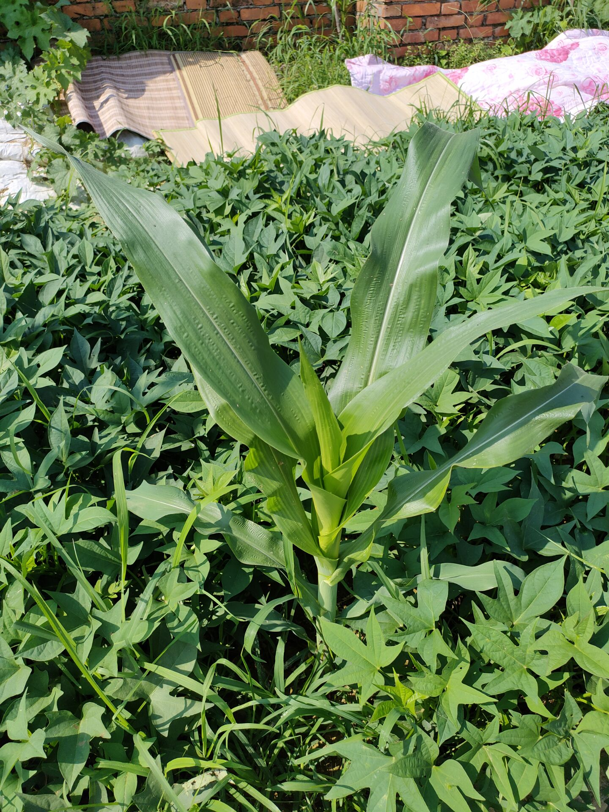
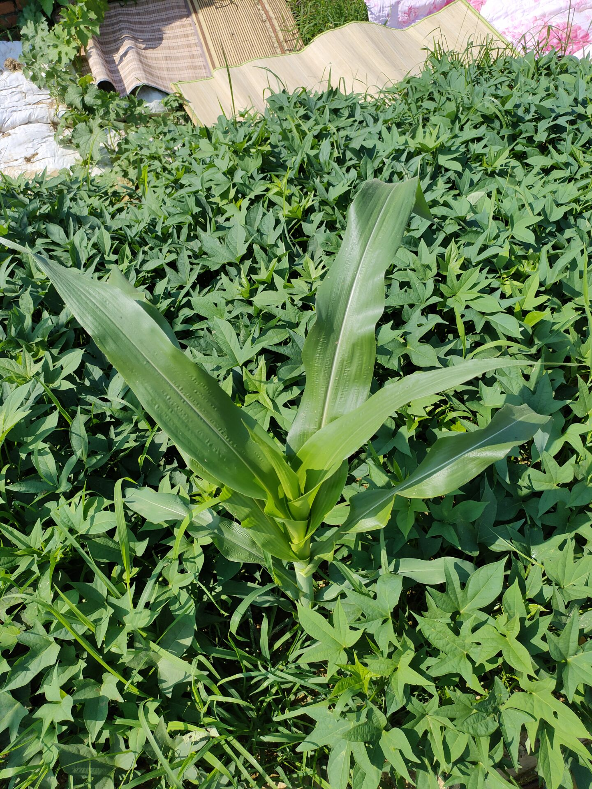
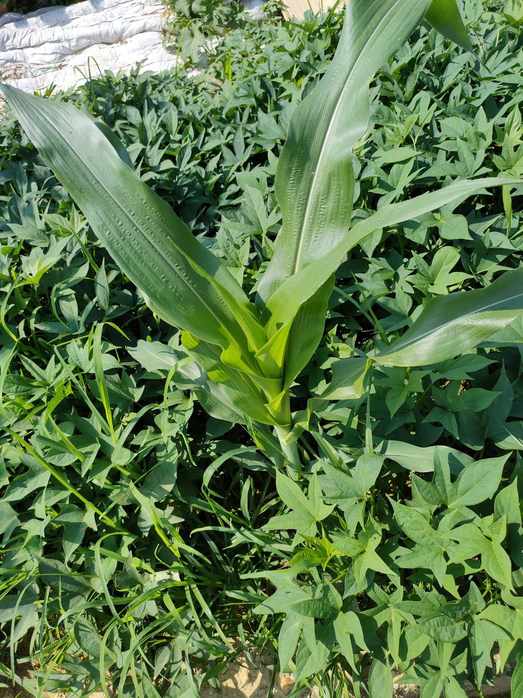

# Task 3

本次实验使用COLMAP + NeRF进行三维重建，需安装COLMAP软件对数据进行预处理，然后使用NeRF模型对物体进行三维重建

由于数据集和COLMAP软件处理后的数据集文件较大，故完整代码+COLMAP处理前后数据集+重建结果上传至云盘，github中仅存有必要代码和结果展示

### How to Run

数据集的COLMAP处理步骤详细记录在report中，将COLMAP处理后的结果文件复制到Nerf项目文件夹 nerf_pytorch/data/nerf_llff_data 下面，并将此文件夹命名为plant文件

命令行输入命令

```
python run_nerf.py --config configs/plant.txt
``````

即可开始进行训练

### Result

#### 训练集部分图片(共19张，展示其中3张)










#### 三维重建结果

https://github.com/Lgssb/dl_final_homework/assets/88122140/e1ac8503-4bad-4d63-ac5d-b86f84c8c98b


### Reference

https://colmap.github.io/

https://github.com/yenchenlin/nerf-pytorch
